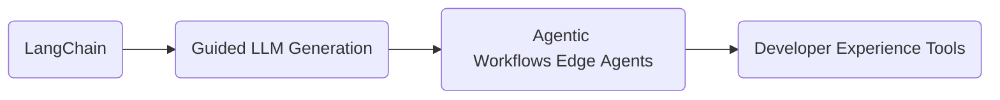

<!-- ============================================================
       GitHub Profile • Vaibhav Doddihal (@vibbs)
       ============================================================ -->

<h2 align="center">Hey there, I’m Vaibhav Doddihal 👋</h2>

  <em>Staff‑level Platform Engineer · Open‑source contributor · Anime enthusiast · Cocktail tinkerer</em>

---

## 🛠️ What I Do

| Area | TL;DR |
|------|-------|
| **GenAI** | I've been delving into emerging standards like Anthropic's Model Context Protocol (MCP) and Google's A2A protocol |
| **Platform Engineering** | Re‑architected workflow engines for **2&nbsp;M + users**, trimmed cloud COGS **15 %**, and cut P99 latency **40 %**. |
| **Open Source** | Still trying! I don't want to spam anyone!! |
| **Knowledge Sharing** | Author at <a href="https://blocksimplified.com/">BlockSimplified</a> – breaking complex ideas into bite‑sized blocks. |

---

## 🔭 Currently Focused On

* Learning advanced prompt‑engineering & vector databases  
* Building high‑throughput, fault‑tolerant task orchestration in Node.js / Python  
* Writing deep dives on AI, platform cost optimisation, and career growth

---

## 🧰 Tech I Enjoy

---

## ✍️ Recent Writings

- **Unlocking the Power of RAG** – design patterns for real‑world apps  
- **Neo4j × OpenAI Workshop Notes** – graphs meet generative AI  
- **Review Systems are Broken** – and how to fix them  
(Read more on <a href="https://blocksimplified.com/">BlockSimplified</a>)

---

## 💬 Let’s Connect

---

  

  
🍣 Fun facts

  - 🎮 Currently trying to create a 5 year roadmap for self
  - 🍹 Recent Favourite cocktail experiment: Bear Mimosa 
  - 📚 Manga binge: *One Piece*
  

  <!--
  vibbs/vibbs is a ✨ special ✨ repository because its README appears on your GitHub profile.
  -->
