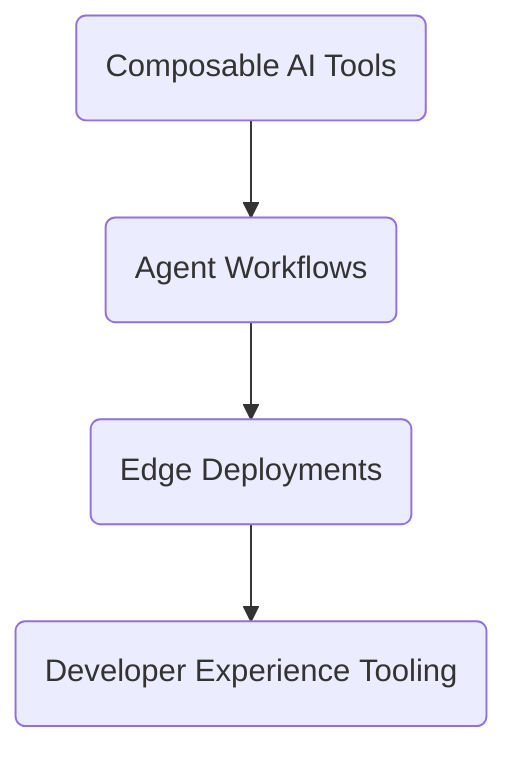

<!-- ============================================================
       GitHub Profile • Vaibhav Doddihal (@vibbs)
       ============================================================ -->

<h2 align="center">Hey, I’m Vaibhav Doddihal 👋</h2>

  <em>Principal Engineer · Solution Architect · Builder of SaaS & AI Systems · Chronic Simplifier</em>

---

## 🛠️ What I Actually Do

| Area | TL;DR |
|------|-------|
| **GenAI / Agentic Systems** | Playing with composable stacks – LangGraph, CrewAI, PydanticAI, Google AI Studio, Azure Studio – to see how many agents it takes to replace a boring cron job. |
| **Platform Engineering** | Designed & scaled SaaS for 2M+ users, cut cloud bills 15%, dropped P99 latency 40%. Translation: fewer 3 AM on-call nightmares. |
| **Architecture** | Event-driven, microservices, plugin-based platforms… aka: "if it scales and doesn’t bankrupt you, I’m in." |
| **Knowledge Sharing** | Writing at <a href="https://blocksimplified.com/">BlockSimplified</a> – breaking tech into digestible blocks (because nobody deserves a 200-page whitepaper hangover). |

---

## 🔭 Currently Focused On

- Orchestrating GenAI agents with LangGraph, CrewAI, Google AI Studio, Azure Studio (and friends).

- Exploring fault-tolerant, high-throughput orchestration (Python / Node.js).

- Writing about AI in production, platform cost-kills, and career lattices (a.k.a. not a ladder).

---

## 🧰 Tech I Enjoy

           

---

##  ✍️ Recent Writings

How to get started with AI: Learning Pathways for Tech and Beyond – finding your AI learning track without the overwhelm (Mar 2025)

Understanding RAGs, Multimodal RAGs and the Future of Enterprise Search – why RAG is more than just another buzzword (Feb 2025)

Neo4j with OpenAI: Building Generative AI Solutions – graphs meet generative AI (Nov 2024)
(More at <a href="https://blocksimplified.com/">BlockSimplified</a>)

##  💬 Let’s Connect

   

 
🍣 Fun facts

🎮 Planning a 5-year roadmap (spoiler: side projects everywhere).

🍹 Current cocktail experiment: Bear Mimosa.

📚 Manga binge: One Piece – still catching up on latest ones.

